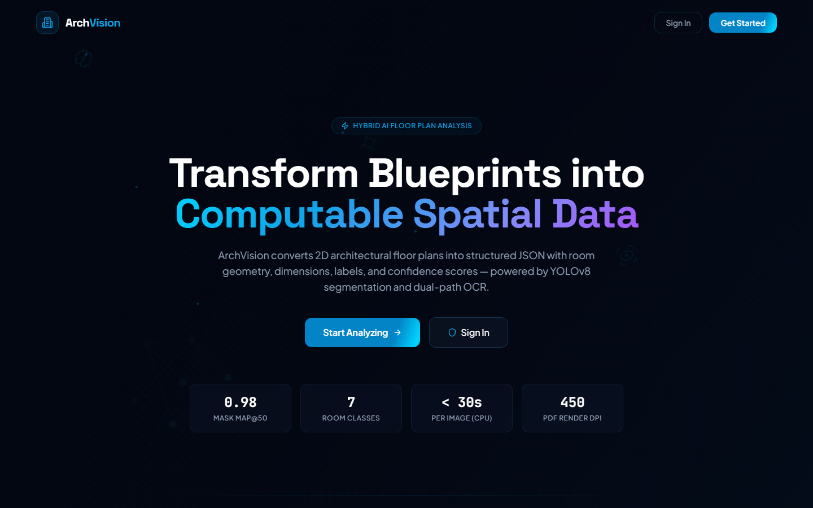
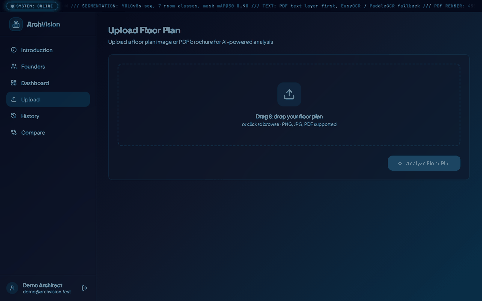
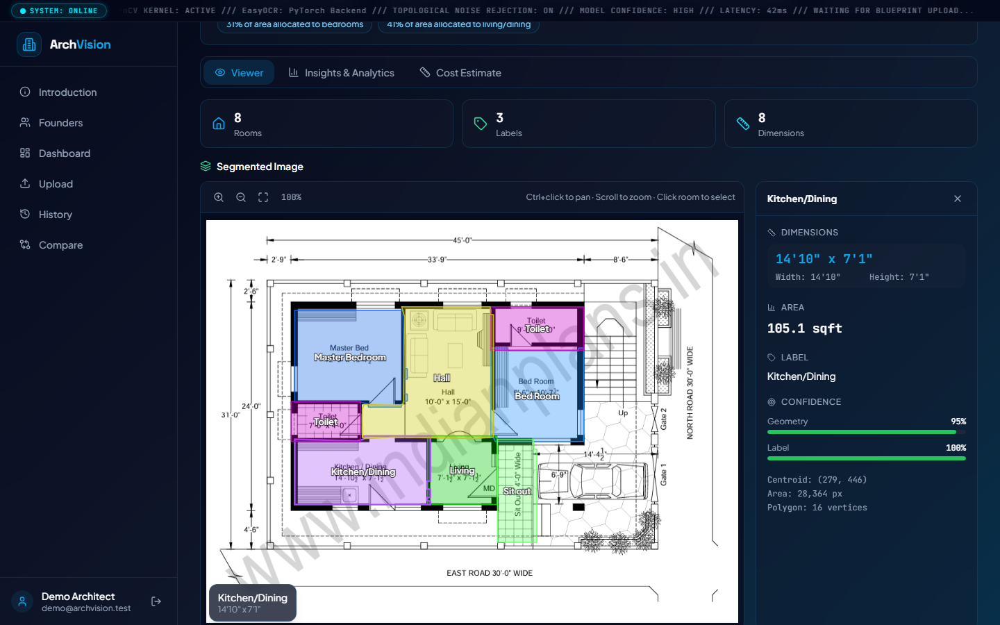
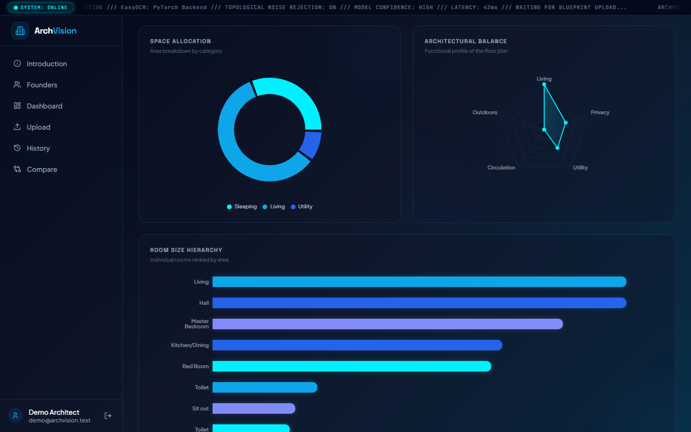
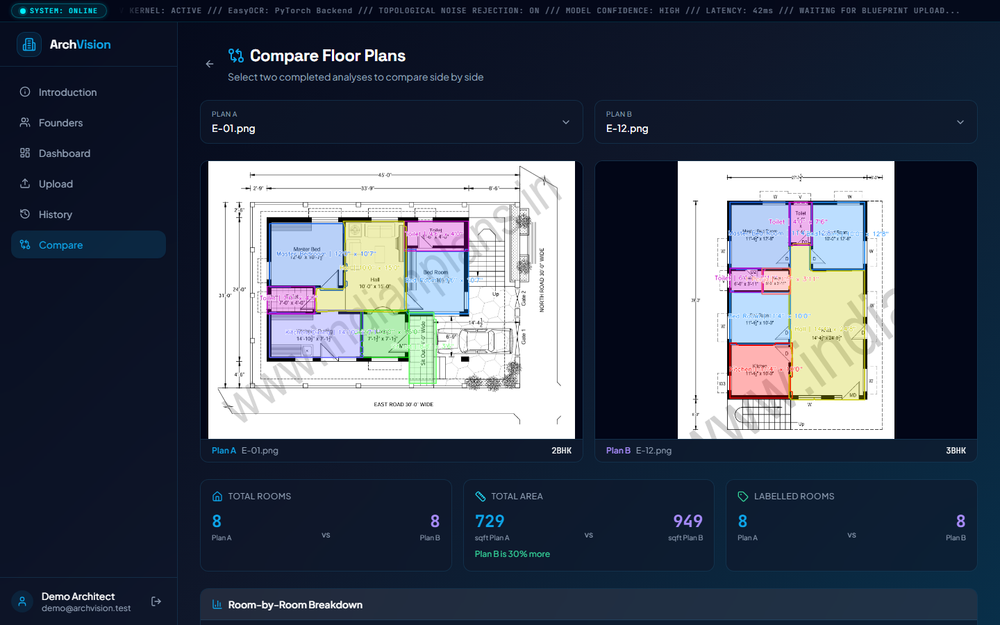
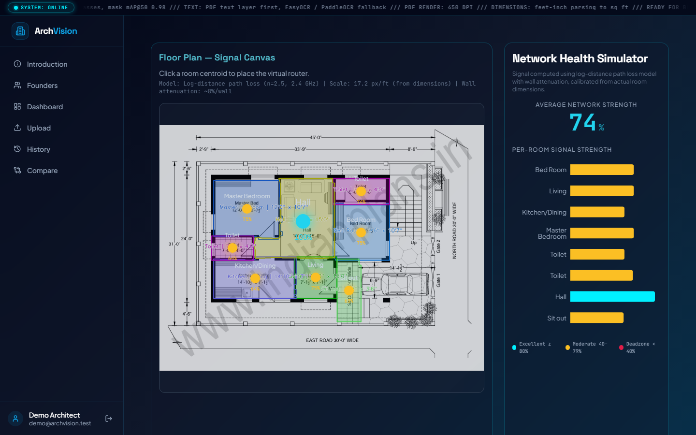
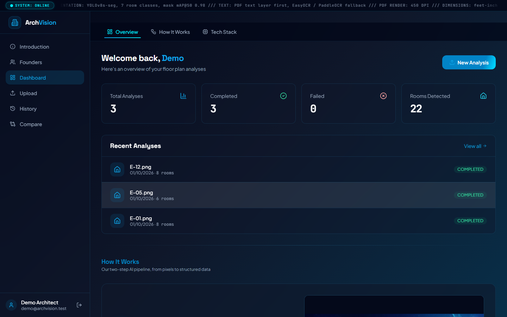
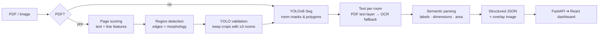
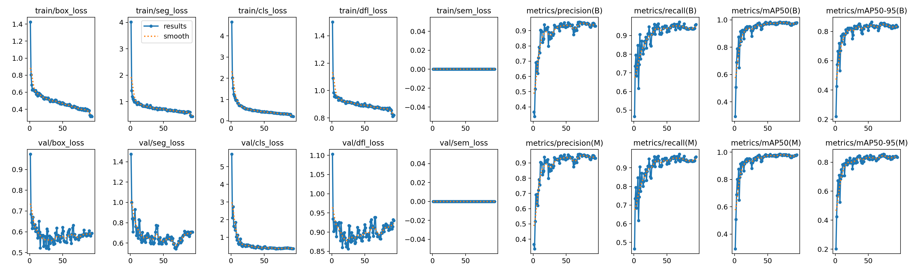
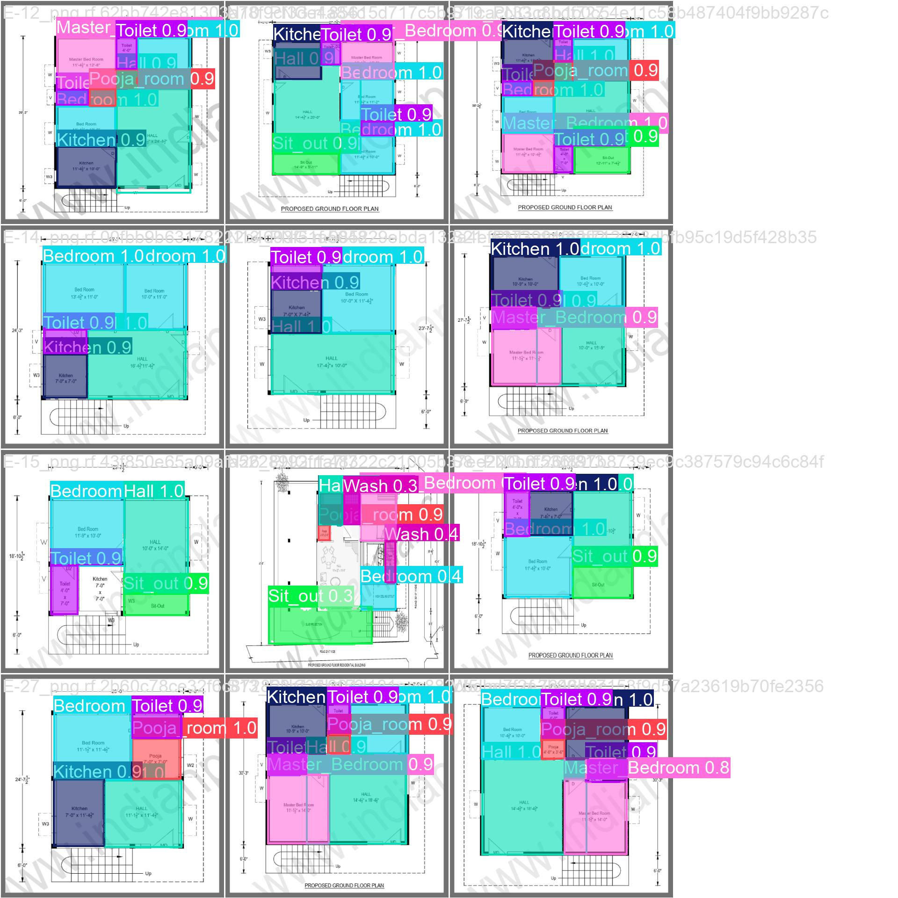

<div align="center">

# 🏛️ ArchVision

### Turn 2D architectural floor plans into structured, queryable data

Upload a floor plan image or a property brochure PDF. ArchVision finds every room, reads its label and dimensions, and returns clean JSON with geometry and confidence scores. Results open in an interactive web dashboard.

[](https://github.com/Parth-Talsania/Archvision/actions/workflows/ci.yml)




</div>

---

## ✨ Highlights

- **Room instance segmentation**: a custom-trained YOLOv8s-seg model outlines every room as a polygon. On the validation split it scores **mask mAP@50 = 0.98**.
- **Dual-path text extraction**: digital PDFs use their embedded text layer (PyMuPDF). Scans and images fall back to per-room OCR with EasyOCR or PaddleOCR.
- **Dimension parsing**: imperial dimensions such as `12'6" x 10'` become width, height and area in sq ft.
- **Brochure-aware PDF extraction**: each page is scored and candidate regions are cropped. A crop is kept only if YOLO confirms it is a real floor plan with at least 3 rooms. Photos, logos and marketing pages are filtered out.
- **Full-stack web app**: FastAPI backend with JWT and Google/GitHub OAuth, SQLite history, and live progress streaming for PDFs.
- **Interactive results views**:
  - Zoomable SVG room overlay
  - Analytics dashboard
  - Side-by-side comparison of two plans
  - Cost estimator
  - Printable spatial report
  - Natural-language property summary
- **Wi-Fi dead-zone mapper**: a proof-of-concept that reuses room centroids to simulate router signal coverage.

## 🎬 Demo

Upload a plan, watch the pipeline run, then explore rooms, analytics and the Wi-Fi mapper:

<p align="center"></p>

## 📸 Screenshots

| Interactive room viewer | Insights & analytics |
|---|---|
|  |  |
| **Side-by-side plan comparison** | **Wi-Fi dead-zone mapper** |
|  |  |
| **Dashboard** | |
|  | |

## 🧠 How it works



Each room in the output looks like this:

```json
{
  "id": 1,
  "label": "Bedroom",
  "dimensions": "12'6\" x 10'",
  "dimensions_parsed": { "width_ft": 12, "width_in": 6.0, "height_ft": 10, "height_in": 0.0, "area_sqft": 125.0 },
  "area": { "value_sqft": 125.0, "source": "computed_from_dimensions" },
  "confidence": { "geometry": 0.95, "label": 0.87, "dimensions": 0.92 },
  "geometry": { "centroid": { "x": 250.5, "y": 180.2 }, "polygon": [[200,150],[300,150],[300,210],[200,210]] }
}
```

The full schema is in [`docs/ARCHITECTURE.md`](docs/ARCHITECTURE.md).

## 📊 Model performance

YOLOv8s-seg, fine-tuned on a Roboflow floor-plan dataset (200 training images after augmentation, 640 px, 94 epochs). Scores are on the 12-image validation split:

| Metric | Box | Mask |
|---|---|---|
| Precision | 0.951 | 0.951 |
| Recall | 0.949 | 0.949 |
| mAP@50 | 0.981 | 0.981 |
| mAP@50-95 | 0.855 | 0.856 |

<p align="center">
  <br>
  
</p>

### End-to-end accuracy on unseen plans

The full pipeline (segmentation, OCR, parsing) on 10 floor plans, 72 rooms, that the model never saw during training or validation. Each plan's room labels and printed dimensions are the ground truth:

| Metric | Result |
|---|---|
| Rooms found | **96%** (69/72) |
| Detections that are real rooms | **92%** (69/75) |
| Correct room label | **99%** (68/69) |
| Dimensions read exactly | **79%** (54/68) |
| Median area error | **0.4%** |

Most dimension errors come from two small, low-resolution scans (N2 and S15), where OCR misreads or misses the printed text. Per-plan results and every error are listed in [`eval/RESULTS.md`](eval/RESULTS.md). Reproduce with `python eval/evaluate.py`.

## 🚀 Quick start

### Option A: Docker (one command)

```bash
docker compose up --build
```

Open <http://localhost:8080>. The first build downloads PyTorch (CPU) and takes a few minutes. The first analysis also downloads the EasyOCR models (~100 MB), which are cached in a volume. To use a fixed secret key or Google/GitHub login, copy `.env.example` to `.env` before starting.

### Option B: Run locally

**Prerequisites:** Python 3.10+, Node.js 18+. The trained model is included at `models/best.pt`.

#### 1. Backend

```bash
python -m venv .venv
# Windows: .venv\Scripts\activate    Linux/macOS: source .venv/bin/activate
pip install -r backend/requirements.txt
cp .env.example .env                # set ARCHVISION_SECRET_KEY (OAuth keys are optional)
python -m uvicorn backend.main:app --reload --port 8000
```

Interactive API docs: <http://127.0.0.1:8000/docs>

#### 2. Frontend

```bash
cd frontend
npm install
npm run dev
```

Open <http://localhost:8080>, create an account and upload a floor plan.

### Command-line usage (no web app)

```bash
# Single image or a folder of images
python scripts/run_pipeline.py --model models/best.pt --image path/to/plan.png --output-dir results/out --frontend-format

# Brochure PDF → extract floor plans → analyse each one
python scripts/run_pdf_pipeline.py --model models/best.pt --pdf path/to/brochure.pdf --output-dir results/pdf_out
```

For a hosted GPU run, use [`training/kaggle_notebook.ipynb`](training/kaggle_notebook.ipynb).

## 🗂️ Project structure

```
├── backend/          FastAPI app: auth (JWT + OAuth), analysis jobs, file serving
│   ├── routes/       auth, oauth, analysis, files
│   └── services/     pipeline wrapper, property-summary generator
├── frontend/         React + Vite + TypeScript web app
├── pipeline/         Core analysis: YOLO rooms, OCR, text merging, parsing, JSON schema
├── pdf_extract/      Floor-plan detection and cropping from brochure PDFs
├── models/           Trained YOLOv8s-seg weights (best.pt)
├── scripts/          CLI runners, evaluation and conversion tools
├── training/         Training script, Kaggle notebook, training run curves and metrics
├── tests/            pytest suite for parsing, geometry and OCR merging
└── docs/             Architecture reference and project reports
```

## 🔌 API overview

| Method | Endpoint | Description |
|---|---|---|
| `POST` | `/api/auth/register` · `/api/auth/login` | Email/password auth, returns a JWT |
| `GET` | `/api/auth/google` · `/api/auth/github` | OAuth sign-in |
| `POST` | `/api/analyze` | Upload an image or PDF for analysis |
| `GET` | `/api/analyses` | Paginated analysis history |
| `GET` | `/api/analyses/{id}` | Full result JSON |
| `GET` | `/api/analyses/{id}/progress` | Live PDF progress (Server-Sent Events) |
| `GET` | `/api/analyses/{id}/summary` | Generated property description |
| `GET` | `/api/analyses/{id}/download` | Download result JSON |
| `GET` | `/api/dashboard` | Usage statistics |

## 🧪 Tests

```bash
python -m pytest tests
cd frontend && npm test
```

## 🛠️ Tech stack

**AI / Backend:** YOLOv8 (Ultralytics) · PyTorch · EasyOCR · PaddleOCR · OpenCV · PyMuPDF · Shapely · NumPy · FastAPI · SQLAlchemy · python-jose · bcrypt

**Frontend:** React 18 · Vite · TypeScript · Tailwind CSS · shadcn/ui · TanStack Query · Recharts · Framer Motion

## 👥 Team

| Name | Role |
|---|---|
| [Mohammed Ayaan](https://github.com/ayaanm786) | Lead AI & Computer Vision Engineer, Frontend |
| [Parth Talsania](https://github.com/Parth-Talsania) | Deep Learning & OCR Specialist |
| Abhishek Rathod | Full-Stack Systems Architect |
| Harshil Darji | Lead UI/UX Developer |
| Heli Darji | Data Engineering & Analytics Lead |

## 📄 License

[MIT](LICENSE)
